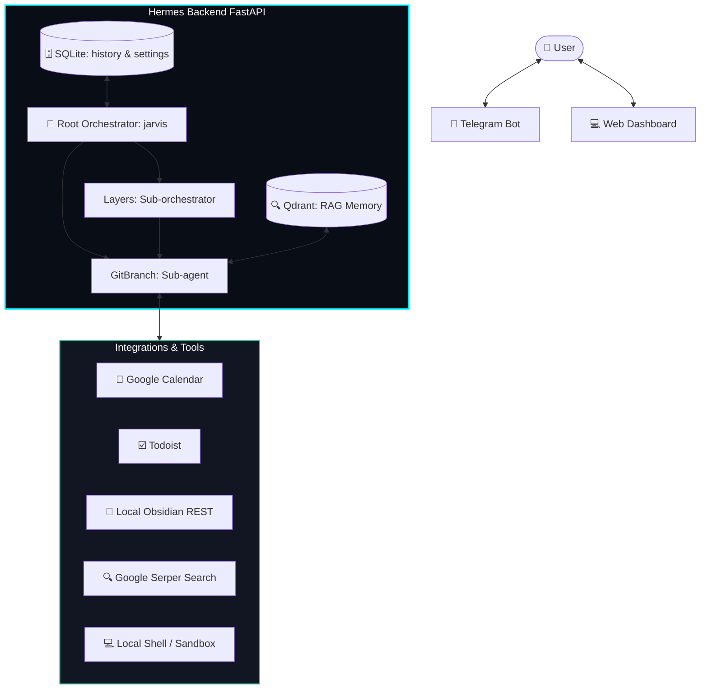

# 🏛️ Hermes: Light Hierarchical AI Agent Network with Visual Canvas

[](https://opensource.org/licenses/MIT)
[](https://www.python.org/downloads/)
[](https://www.docker.com/)

**Hermes** is a low-code, self-hosted framework for building managed networks of AI agents. Inspired by JARVIS, it combines a beautiful React visual canvas (drag-and-drop node graph) with an autonomous planning backend.

Unlike deterministic workflow builders (like n8n), Hermes resolves complex user requests on the fly using a dynamic LLM planning loop. Unlike chaotic multi-agent groups (like AutoGen), Hermes uses a strict Directed Acyclic Graph (DAG) hierarchy to keep agents coordinated and prevent infinite feedback loops.

---

## 📸 Dashboard Preview

[](https://youtu.be/3GFh-1Gglno)

The built-in Web Dashboard is running on port `9119` and features:
1. **Communication Hub**: Live chat interface with the main orchestrator (Jarvis) or isolated sub-agents.
2. **Core Config**: Real-time adjustment of system prompts, models, and active system properties.
3. **Decision Logs**: Full visual telemetry of the planner's "thoughts", decision latencies, token consumption, and errors.
4. **Memory Vault (RAG)**: Manage vector database documents (PDF, MD, TXT) parsed and indexed dynamically into Qdrant.
5. **System Core Monitor**: Track host system telemetry (CPU/RAM/Disk), running timers, and active price alerts.

---

## 🏛️ System Architecture



### 🔐 Security & Permission Intersection
To execute actions safely, Hermes implements **Permission Intersection** down the execution tree:
`AllowedTools = ChildTools ∩ ParentTools`

If a parent sub-orchestrator restricts tools to `web_search`, its child sub-agents can never invoke dangerous actions like `execute_command`, even if those agents have the command line skill configured.

---

## 🚀 Quick Start

Ensure you have **Docker** and **Docker Compose** installed.

### 1. Clone the repository
```bash
git clone https://github.com/your-username/hermes.git
cd hermes
```

### 2. Configure Environment Variables
Copy the template configuration file:
```bash
cp .env.example .env
```
Open `.env` and fill in your keys (at minimum, `OPENROUTER_API_KEY`, `TELEGRAM_BOT_TOKEN`, and `TELEGRAM_CHAT_ID` are required).

### 3. Launch the Stack
```bash
docker compose up -d --build
```
This starts the backend (FastAPI), frontend dashboard (Nginx/React), and vector database (Qdrant).

### 4. Access the Dashboard
Open your browser and navigate to:
```
http://localhost:9119
```

*Sir, your dashboard is online.*

---

## ⚙️ Configuration & Integrations

Hermes starts gracefully even if optional integrations are not configured.

### 🤖 LLM Models (OpenRouter)
Set `OPENROUTER_API_KEY` in `.env`. By default, Hermes uses `google/gemini-2.5-flash` for high-speed planning, but you can configure separate models for each specialized role (e.g. Research, Code, Analyst).

### 💬 Telegram Integration
1. Create a bot via [@BotFather](https://t.me/BotFather) on Telegram and retrieve the token (`TELEGRAM_BOT_TOKEN`).
2. Get your numeric Telegram chat ID via [@userinfobot](https://t.me/userinfobot) and set `TELEGRAM_CHAT_ID`.
3. Start the bot on Telegram by typing `/start`.

### 📅 Google Calendar (OAuth2 Manual Flow)
If you wish to allow Hermes to manage your calendars:
1. Place your Google API desktop app OAuth credentials as `client_secret_*.json` in the root folder.
2. Ensure you have the required dependencies and run the local auth script on your host system:
   ```bash
   pip3 install google-auth-oauthlib google-api-python-client
   python3 backend/google_auth.py
   ```
3. Complete the login flow. The generated `google_token.json` is automatically mapped into the docker container.

### 📓 Local Obsidian REST Integration
1. Install the **Local REST API** plugin in Obsidian.
2. Enable HTTPS and copy the generated API key.
3. Configure `OBSIDIAN_API_KEY`, `OBSIDIAN_PORT`, and `OBSIDIAN_VAULT_PATH` in `.env`. Hermes will sync and index your vault chunks into the Qdrant RAG index in the background.

---

## 📂 Project Structure

* `/backend`: FastAPI server, agents, tools registry, DB migrations, Telegram listeners.
* `/frontend`: React + Vite client web dashboard.
* `docker-compose.yml`: Multi-container configuration (Backend, Dashboard, Qdrant).
* `ROADMAP.md`: Detailed developmental roadmap, specifications, and business plan.

---

## 🛡️ License

This project is licensed under the MIT License - see the [LICENSE](LICENSE) file for details.
