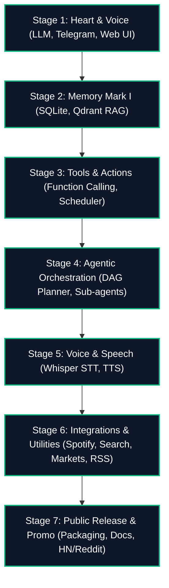
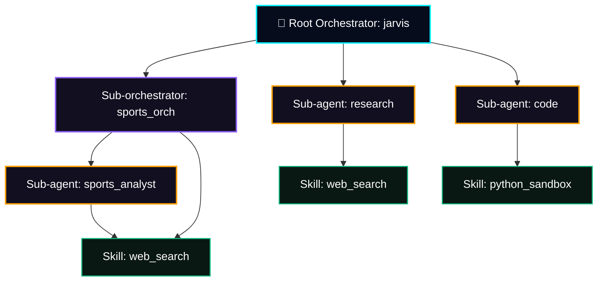

# 🏛️ Project Hermes (Jarvis): Unified Roadmap and Specification

This document consolidates the technical specification, user guide, business model, and marketing strategy for the **Hermes (Jarvis Agent Network)** system.

---

## 📅 Development Status & Roadmap

The project has successfully completed the core system loop, vector memory RAG pipeline, and basic integrations. The current state and upcoming milestones:



### 🟢 Completed Milestones (Core System)
1. **Stage 1: Heart & Voice (LLM + Telegram + Web UI)**
   * OpenRouter model integration (`google/gemini-2.5-flash` by default).
   * Async FastAPI backend and Telegram bot handlers.
   * Web Dashboard UI (React + Vite + Vanilla CSS) on port `9119`: Chat, prompt/model settings, decision logs telemetry.
2. **Stage 2: Memory Mark I (SQLite + Qdrant RAG)**
   * SQLite database for message history and dynamic agent configurations.
   * Qdrant vector database for document storage, splitting, indexing, and semantic lookup.
3. **Stage 3: Tools & Actions (Function Calling & Alerts)**
   * Function calling parsing loop (API Tools).
   * Local command execution (weather, RSS parsing, system metrics).
4. **Stage 4: Agentic Orchestration**
   * Migrated to hierarchical task planning using a Directed Acyclic Graph (DAG) model.
   * Parent orchestrators dynamically coordinate execution and delegate steps to sub-agents.
5. **Stage 5: Voice & Speech (STT / TTS)**
   * Whisper API integration for Speech-to-Text and Silero/Coqui voice models for TTS replies.
6. **Stage 6: Integrations & Utilities**
   * Spotify playback commands (playlists, play/pause controls).
   * Crypto and stock price alerts (Bitcoin, TON monitoring and thresholds).
   * Google custom search tool via Serper API and daily RSS news digests.
7. **Stage 7: Public Release & Promo**
   * Codebase cleaned and licensed under MIT on GitHub (`hermes-synapse`).
   * Marketing campaigns and posts launched on LinkedIn, Facebook, Medium, Reddit, X (Twitter), and Telegram.

---

## 🏛️ Technical Architecture Specification

Hermes is a low-code platform designed to configure and run managed networks of AI agents connected via a Directed Acyclic Graph (DAG).



### 1. Node Types in the Graph
1. **Root Orchestrator (`Root Orchestrator`)**: The entry point for user queries (ID: `jarvis`). Manages planning and child nodes delegation.
2. **Sub-orchestrators (`Sub-orchestrators`)**: Intermediate coordinators. When triggered, they run a local planning loop among their own child nodes.
3. **Sub-agents (`Sub-agents`)**: Specialized executors running a dedicated system prompt. They execute tasks using configured skills.
4. **Skills (`Skills`)**: Static sets of API functions that can be mapped to sub-agents or sub-orchestrators.

### 2. Database Schema (SQLite)
The node hierarchy, properties, and canvas coordinates are defined in the `subagents` table of `hermes.db`:

```sql
CREATE TABLE IF NOT EXISTS subagents (
    id TEXT PRIMARY KEY,                       -- Unique identifier string (e.g. sports_analyst)
    name TEXT NOT NULL,                        -- Display label in UI
    system_prompt TEXT NOT NULL,               -- System prompt for the LLM
    model TEXT NOT NULL,                       -- Model identifier (e.g. google/gemini-2.5-flash)
    created_at DATETIME DEFAULT CURRENT_TIMESTAMP,
    agent_type TEXT DEFAULT 'agent',           -- Node type: 'agent', 'sub-orchestrator', 'orchestrator'
    parent_id TEXT,                            -- Parent orchestrator ID (defines hierarchy)
    skills TEXT DEFAULT '',                    -- Comma-separated list of enabled skills (e.g. 'web_search,obsidian_rag')
    x INTEGER DEFAULT 100,                     -- X-coordinate on the visual canvas
    y INTEGER DEFAULT 100                      -- Y-coordinate on the visual canvas
);
```

### 3. Skills and API Tools Mapping Matrix

| Skill ID | Display Name | Allowed Functions (API Tools) |
| :--- | :--- | :--- |
| **`web_search`** | Web Search | `web_search`, `get_current_time_israel`, `get_weather`, `get_rss_digest` |
| **`market_monitor`** | Market Monitor | `get_market_prices`, `add_price_alert` |
| **`obsidian_rag`** | Obsidian Vault | `search_obsidian`, `read_obsidian_note`, `create_obsidian_note`, `sync_obsidian_vault` |
| **`todoist_sync`** | Todoist Sync | `get_todoist_tasks`, `add_todoist_task`, `delete_todoist_task` |
| **`google_calendar`**| Google Calendar | `get_calendar_events`, `add_calendar_event` |
| **`timers_alarms`** | Timers & Alarms | `set_timer`, `set_alarm`, `cancel_timer_or_alarm` |
| **`shell_execution`**| Shell Execution | `get_system_stats`, `execute_command` |
| **`python_sandbox`** | Python Sandbox | `execute_command` |

> [!NOTE]
> System memory utilities `save_subagent_memory` and `get_subagent_memory` are always enabled for all sub-agents.
> Orchestrator operations (`create_subagent`, `call_subagent`, `list_subagents`) are restricted to the root `jarvis` node.

### 4. Core Algorithms & Security Logic

* **Permission Intersection**:
  To protect nodes from unauthorized or destructive tool execution in nested branches, sub-agents are restricted to the intersection of their own tools and those of their parents:
  
  `AllowedTools = ChildTools ∩ ParentTools`
  
  If a parent sub-orchestrator has no skills configured, it is considered unrestricted, and the child agent resolves to its own full capabilities.
* **Standalone Fallback Mode**:
  If a sub-orchestrator is triggered but has no child nodes attached in the database, it automatically runs as a terminal agent executor, using only the tools allowed by its own skills.
* **JSON Validation & LLM Schema Retry**:
  The backend parses and validates json outputs of the planner. If schema validation fails, it automatically issues a retry request to the LLM, feeding the parsing error back into the context to correct the output dynamically.

### 5. Visualization & Connectors (Frontend Graph Representation)

* **Interactive Zoom & Pan**:
  * Mouse wheel scroll scales the canvas (`30%` to `200%`) focused on the cursor position.
  * Click-and-drag panning enables infinite exploration across the canvas background.
* **Infinite Grid Layout**:
  * Point grid pattern is rendered dynamically on the wrapper. Position and scale are calculated as:
    * `backgroundSize = 24 * zoom`
    * `backgroundPosition = panOffset`
  * This preserves the illusion of an infinite canvas with zero boundaries.
* **All-Draggable Nodes**:
  * Every card on the canvas is draggable, including the root `JARVIS` node and static `Skill` cards.
  * Skill positions are saved in `localStorage` (`jarvis_skill_positions`), and agent positions are synchronized via `/api/subagents/positions` to the database.
* **Connection Routing**:
  * Orchestrator output port (`node.x + 220, node.y + 50`) maps to agent input port (`node.x, node.y + 50`) to set the `parent_id` link.
  * Agent output port maps to skill input port to add the skill string to the agent's `skills` configuration.

---

## 📖 User Guide: Working with Sub-agents

You can create and manage specialized sub-agents through two main interfaces:

### Method 1: Conversational Prompts via Jarvis Chat
Simply ask the main orchestrator to configure and register a new agent:
> *"Jarvis, create a sub-agent to help me analyze football matches. Make him a professional sports analyst using the deepseek model."*

### Method 2: Visual Canvas (Sub-agents Factory)
Go to the visual "Subagents" tab on the Web Dashboard:
1. **Manual Creation**: Click the dashed "Create Agent" card, input slug ID, display name, system instructions, and select the AI model.
2. **Connecting Nodes (Drag-and-Drop)**:
   * Draw connection lines from Orchestrator outputs to Agent inputs to define structural parent links (`parent_id`).
   * Draw connection lines from Agent outputs to Skill cards to append tools (`skills`).
3. **Isolated Workspace**: Clicking any agent card on the left panel opens an isolated chat interface dedicated to that agent's history and instructions.

---

## 📈 Market Positioning & Competitors

Hermes is positioned at the intersection of visual ETL pipelines and multi-agent code frameworks:

| Feature | Hermes (Jarvis) | n8n / Make | Flowise / LangFlow | AutoGen / CrewAI / LangGraph |
| :--- | :--- | :--- | :--- | :--- |
| **Execution Logic**| Non-deterministic (AI builds plan dynamically) | Deterministic (Hardcoded workflow logic) | Visual chains of LLM prompts | Code-defined agent graphs |
| **User Interface** | Interactive SVG Canvas + isolated chats | Node-editor for API pipelines | Visual chain designer | CLI / API (No native dashboard) |
| **Hierarchy** | Strict DAG (prevents infinite cycles) | Linear or conditional steps | Data-flow graphs | Free conversational loops (high cycle risk) |
| **Security** | Permission Intersection | Hardcoded auth credentials | Sandbox container | Runs python code locally by default |

---

## 💰 Business Plan & Monetization ("Hermes Enterprise")

Due to its hierarchical DAG design, Hermes coordinates a digital workforce rather than serving as a basic conversational assistant.

### 1. Monetization Models

* **Hermes Cloud (SaaS)**:
  * Managed cloud hosting for builders and startups. Removes the need to set up SQLite and Qdrant locally.
  * Subscription model ($29 – $99/month) + metered LLM token consumption.
* **Enterprise Edition**:
  * Self-hosted instance with production database support (PostgreSQL/ClickHouse), Single Sign-On (SSO) authentication, audit logs of agent actions, and secure containerized environments for shell execution.
  * Enterprise license starting at $500/month or custom annual contracts.
* **Skills Marketplace**:
  * Paid premium connectors (SAP, Salesforce, 1C, HubSpot).
  * Transaction fees on sales of third-party custom skills.

### 2. Go-To-Market Strategy (2026)
* **Phase 1: Community Adoption (Months 1–3)**
  Release core repository under MIT/Apache 2.0. Aim for the first 1,000+ stars on GitHub. Highlight the React canvas and Obsidian vault RAG.
* **Phase 2: Cloud Beta Launch (Months 4–6)**
  Roll out Hermes Cloud. Give free beta slots to active GitHub contributors in exchange for reviews.
* **Phase 3: B2B Integration Services (Months 6+)**
  Provide consulting and integration services for local businesses. Deliver pre-packaged agent teams ("AI Copywriter", "AI Market Researcher") for $3,000 – $10,000 per setup.

---

## 🌟 GitHub Release & Star Strategy

To generate traction on GitHub, we deploy the following release model:

### 📦 Repository Packaging: **"Hermes Framework: Light Hierarchical Agents"**
A clean self-hosted solution (FastAPI + React) for visual construction and execution of hierarchical agents with code sandboxes and RAG. A lightweight, simple alternative to heavy code frameworks like AutoGen or CrewAI.

### 🚀 Launch Checklist:
1. **Interactive README**:
   * Hero GIF/video showing canvas node connections, adding an Obsidian skill, and running a task.
   * One-line container start command (`docker compose up -d`).
   * Pitch: *"Hermes: visual multi-agent framework with strict hierarchical DAG planning and secure function calling intersections."*
2. **Promotional Channels**:
   * Launch announcement in **Show HN** on Hacker News.
   * Community announcements on Reddit: `r/LocalLLaMA`, `r/MachineLearning`, `r/SelfHosted`, `r/artificial`.
   * Product Hunt campaign.
   * Technical architecture articles published on Medium, Dev.to, and Habr.
